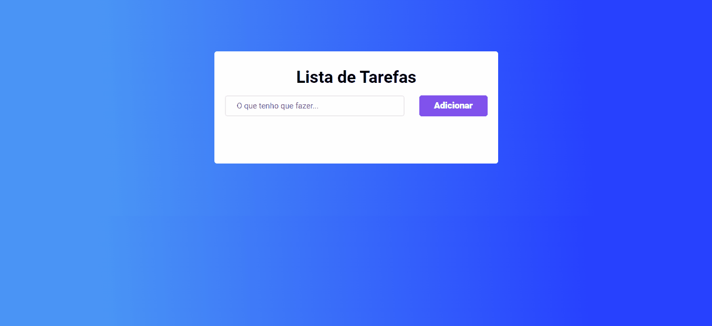

<h1 align="center">Lista de tarefas</h1>

> ## 💻 Projeto
Esse projeto é uma lista de tarefa simples. Nessa aplicação você pode adicionar suas tarefas, marcar como concluidas e excluir. Todas as tarefas adicionadas ficam salvas no localStorage.

Teste a aplicação clicando <a href="https://to-do-list-dv.netlify.app/" target="_blank">Aqui</a>

> ## 📸 Demo

> ## 🚀 Tecnologias 
As seguintes ferramentas foram usadas na construção do projeto:

* [HTML](https://developer.mozilla.org/pt-BR/docs/Web/HTML)
* [CSS](https://developer.mozilla.org/pt-BR/docs/Web/CSS)
* [JavaScript](https://developer.mozilla.org/pt-BR/docs/Web/JavaScript)
* [SweetAlert2](https://sweetalert2.github.io/)

> ## 📝 Licença
Esse projeto está sob a licença MIT. Veja o arquivo [LICENSE](https://github.com/W-Carlos/ToDo-List/blob/master/LICENSE) para mais detalhes.

---

Feito by 👋 Wend Carlos
